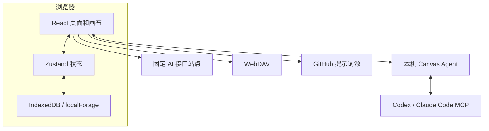

# 无限画布使用技术文档

本文档面向开发者和运维人员，说明主应用、文档站和本地 Agent 的架构、数据流与扩展边界。

## 系统组成



主应用已移除项目后端。Nginx、Vercel 或 Render 只提供静态文件，业务数据和凭据主要留在浏览器侧。

## 技术栈

### 主应用

- Vite 7、React 19、React Router 7、TypeScript。
- Ant Design 6、Tailwind CSS 4、Lucide React。
- Zustand 5 管理全局和画布状态。
- TanStack Query 管理适合请求缓存的异步数据。
- localForage 统一访问 IndexedDB。
- Axios 和 Fetch 访问 AI、WebDAV 和远程资源。
- fflate 处理受限 ZIP 导入导出。
- Vitest 执行单元测试。

### 文档站

- Next.js 16、React 19、Fumadocs。
- 文档内容位于 `docs/content/docs/`。
- 文档站单独构建，不包含在主应用镜像中。

### Canvas Agent

- Node.js 18 及以上、TypeScript、Express 5。
- `@modelcontextprotocol/sdk` 实现 MCP。
- `@openai/codex` 连接 Codex app-server。
- Zod 描述 MCP 工具入参。

## 目录结构

```text
.
├─ web/                         主应用
│  └─ src/
│     ├─ pages/                 路由页面
│     ├─ layouts/               页面布局
│     ├─ components/canvas/     画布组件
│     ├─ stores/                Zustand 状态
│     ├─ services/api/          AI 与远程 API
│     ├─ services/              存储、同步和媒体服务
│     ├─ lib/canvas/            画布工具函数
│     └─ router.tsx             路由配置
├─ canvas-agent/                本机 Agent 与 MCP
├─ plugins/infinite-canvas/     Codex App 插件
├─ docs/                        Next.js 文档站
├─ Dockerfile                   主应用多阶段镜像
├─ docker-compose.yml           发布镜像编排
└─ nginx.conf                   主应用静态服务配置
```

## 前端路由

路由在 `web/src/router.tsx` 中使用 `createBrowserRouter` 配置，主要页面使用 React `lazy` 懒加载：

| 路径 | 页面目录 |
| --- | --- |
| `/` | `web/src/pages/home/` |
| `/image` | `web/src/pages/image/` |
| `/video` | `web/src/pages/video/` |
| `/assets` | `web/src/pages/assets/` |
| `/prompts` | `web/src/pages/prompts/` |
| `/canvas` | `web/src/pages/canvas/` |
| `/canvas/:id` | `web/src/pages/canvas/project.tsx` |

静态部署必须把非文件路由回退到 `index.html`。`/assets/` 是 Vite 构建资源路径，不应回退到入口页。

## 状态管理

主要状态按职责拆分：

- `use-config-store.ts`：固定接口站点、渠道、API Key、模型和 WebDAV 配置。
- `use-asset-store.ts`：本地素材元数据和素材操作。
- `stores/canvas/use-canvas-store.ts`：画布项目索引与按项目持久化。
- `stores/canvas/use-canvas-ui-store.ts`：画布页面临时 UI 状态。
- `stores/canvas/use-canvas-agent-store.ts`：Agent 会话、事件和待确认工具调用。
- 图片和视频工作台各自维护生成记录，并通过存储服务持久化。

组件需要全局状态时直接使用对应 store 或全局 hook，避免把全局动作和配置层层透传。

## 浏览器存储

localForage 数据库名为 `infinite-canvas`。主要 storeName：

| storeName | 内容 |
| --- | --- |
| `app_state` | AI 配置、主题、素材索引、画布索引和按项目 JSON |
| `image_files` | 图片 Blob |
| `media_files` | 视频、音频和其他媒体 Blob |
| `image_generation_logs` | 图片工作台生成记录 |
| `video_generation_logs` | 视频工作台生成记录 |
| `prompt_cache` | 远程提示词缓存 |
| `sync_metadata` | WebDAV 删除墓碑 |

画布项目采用索引加项目独立 key 的方式写入，只持久化发生变化的项目，并在页面隐藏前主动刷盘。大体积业务数据写入 IndexedDB 失败时不会退回 localStorage；只有 AI 配置和主题等小配置允许回退。

## 媒体存储

图片和其他媒体不长期内嵌在画布 JSON 中：

1. 上传或生成结果写入 `image_files` 或 `media_files`。
2. 服务生成 `image:<id>`、`video:<id>`、`audio:<id>` 等 `storageKey`。
3. 节点和素材保存 `storageKey`、元信息及会话内 `blob:` URL。
4. 恢复页面时根据 `storageKey` 重新创建对象 URL。
5. 删除时收集画布、素材、生成记录和运行时引用，再清理无引用 Blob。

对象 URL 仅对当前文档会话有效，不能用作导出格式中的永久文件地址。

## AI 请求层

所有 AI 请求放在 `web/src/services/api/`。模型值内部可编码为 `渠道 ID::模型名`，发请求前通过渠道解析得到真实模型、Base URL、API Key 和调用格式。

Base URL 在 `use-config-store.ts` 中固定为：

```ts
"https://www.aiba.hk"
```

### OpenAI 风格

- 图片：`/v1/images/generations`、`/v1/images/edits`。
- 文本和工具调用：`/v1/responses`。
- 音频：`/v1/audio/speech`。
- 视频：`/v1/videos` 及任务查询和内容端点。
- 模型：`/v1/models`。

### Gemini 风格

Gemini URL、鉴权和消息结构由图片服务中的适配逻辑生成。目前用于模型列表、文本、工具调用、基础生图和图生图，不用于音频和视频。

### Seedance

当模型匹配 Seedance 2.0 时，前端通过固定接口站点兼容的 Agent Plan 路径创建任务并轮询。参考图片、视频和音频会根据远端 URL、本地 Blob 和接口能力转换。

## 画布数据模型

`CanvasProject` 主要包含：

- `id`、`title`、创建和更新时间。
- `nodes` 和 `connections`。
- 助手会话及当前会话 ID。
- 背景模式和视口变换。

`CanvasNodeType` 当前包括 `text`、`image`、`config`、`video` 和 `audio`。节点使用 `metadata` 保存内容、生成状态、模型参数、媒体信息、批次关系和重试上下文。

连线通过节点 ID 表达方向。生成时会从目标节点反向收集上游文本和媒体，构造提示词、参考图、参考视频和参考音频。

## ZIP 导入导出

画布导出当前使用版本 3，素材导出使用版本 1。包内包含：

- 应用标识和格式版本。
- 导出时间与业务数据 JSON。
- 媒体清单，包括 `storageKey`、安全相对路径、MIME 和字节数。
- `files/` 下的实际媒体 Blob。

导入使用 fflate 流式处理，并限制压缩包大小、文件数、单文件大小、总解压体积和 JSON 大小。导入器拒绝路径穿越、重复路径、重复存储键、缺失媒体和字节数不一致。

## WebDAV 同步

同步代码主要位于：

- `web/src/services/webdav-sync.ts`
- `web/src/services/app-sync.ts`
- `web/src/services/sync-merge.ts`
- `web/src/services/sync-tombstones.ts`

同步域包括 `canvas`、`assets`、`image-workbench` 和 `video-workbench`。每个域维护 manifest、业务数据、媒体清单和删除墓碑。

同步流程：

1. 读取远端 manifest 和本地状态。
2. 按记录 ID、更新时间及删除墓碑合并。
3. 补齐本地缺失的远端媒体。
4. 上传远端缺失或内容变化的本地媒体。
5. 写回前重新读取并合并最新本地数据。
6. 上传新 manifest 并更新本地墓碑。

这是一种最终一致的个人数据同步，不提供事务、锁或多人实时协同。

## Canvas Agent 安全模型

Canvas Agent 分为本机 HTTP/SSE 服务和 MCP stdio 服务：

- HTTP 服务默认监听 `127.0.0.1:17371`。
- 前端端点解析只接受 `localhost`、`127.0.0.1` 和 `::1`。
- 自动连接的 URL 和 token 使用 fragment，避免进入静态站访问日志。
- Agent 记录首次授权的网页 Origin，阻止其他 Origin 复用。
- MCP 工具可以读取状态、创建节点、连接节点和触发生成。
- 画布写操作在网页侧形成待确认请求。
- Claude CLI HTTP Adapter 已移除，Claude Code 通过同一 MCP 操作画布。

## 构建和部署

### 主应用

```bash
cd web
bun install
bun run build
```

`build` 会先执行 TypeScript 无输出检查，再运行 Vite 构建。Dockerfile 使用 `oven/bun:1.3.13` 构建，并把 `web/dist` 复制到 `nginx:1.27-alpine`。

Nginx 配置提供：

- SPA 路由回退。
- `/assets/` 长期缓存和入口 no-cache。
- CSP、点击劫持防护、MIME 嗅探防护和权限策略。
- gzip 压缩。
- `/healthz` 健康检查。
- 本机 Agent 的 IPv4 和 IPv6 回环连接许可。

### 文档站

```bash
cd docs
bun install
bun run build
```

文档站有独立 Dockerfile、Compose 和镜像工作流。

## 质量检查

主应用脚本：

```bash
cd web
bun run lint
bun run test
bun run build
```

Canvas Agent：

```bash
cd canvas-agent
bun install
bun run build
```

`.github/workflows/quality.yml` 会在 `main` 推送和 Pull Request 时执行前端 TypeScript 检查、Vitest 和 Canvas Agent 构建。

## 扩展约束

- 新 API 请求统一放在 `web/src/services/api/`。
- 跨页面状态放在 `web/src/stores/`。
- 画布页面、组件、状态和工具函数继续按现有目录边界维护。
- 业务大数据使用 localForage，不使用 localStorage 保存图片、base64 或大 JSON。
- 新媒体必须通过图片或文件存储服务写入，并保持 `storageKey` 引用关系。
- 新同步业务域需要同时定义合并规则、媒体清单和删除语义。
- 新 Nginx 或静态托管配置必须保持前端路由回退和入口缓存策略。

## 当前边界

- 主应用没有后端、数据库、账号和服务端权限模型。
- 浏览器本地数据不会因访问同一账号自动同步。
- WebDAV 不提供实时协作和冲突交互界面。
- API Key 对终端设备和浏览器环境可见。
- 移动端画布交互尚未完成系统适配。
- Docker 静态部署和各类反向代理组合仍需要发布前人工验证。

详细功能状态见 [功能介绍](docs/content/docs/overview/features.mdx)、[待测试](docs/content/docs/progress/pending-test.mdx) 和 [TODO](docs/content/docs/progress/todo.mdx)。
