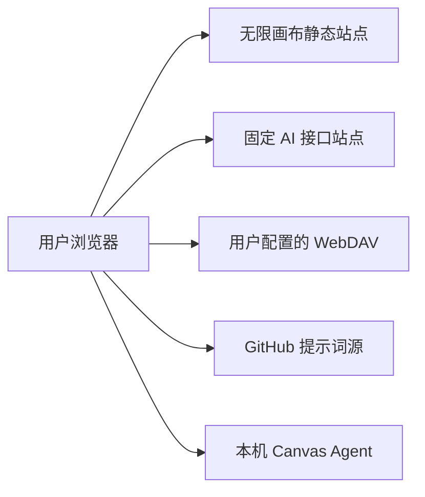

# 无限画布部署文档

本文档说明主应用的本地运行、Docker、反向代理和静态托管方式。主应用是 Vite 构建的静态前端，不包含账号、数据库或 AI 代理后端。

## 部署架构



- 页面、脚本和样式由静态站点提供。
- AI 请求由浏览器直接发送到唯一固定接口站点 `https://www.aiba.hk`。
- API Key、画布、素材和生成记录默认保存在用户浏览器中。
- WebDAV、提示词源和本机 Canvas Agent 也由浏览器直接连接。
- 对外开放所需的账号、计费、配额、审计和风控应由固定 AI 接口站点承担。

## 服务器要求

主站只提供静态资源，服务器压力较低：

- 最低建议：1 核 CPU、1 GB 内存、10 GB 可用磁盘。
- 常规建议：2 核 CPU、2 GB 内存。
- 2 核 4 GB 对此项目已经比较充足，可同时运行反向代理和基础监控。
- 用户生成的图片和视频通常在浏览器与 AI 接口站点之间传输，不经过静态站服务器。

实际带宽主要取决于页面静态资源、访问人数和是否额外代理其他服务。若只部署本项目，1000 GB 月流量通常有较大余量。

## Docker Compose 部署

要求 Docker Engine 和 Docker Compose v2。

```bash
git clone https://github.com/cnxmu/infinite-canvas.git
cd infinite-canvas
docker compose pull
docker compose up -d
```

默认使用以下配置：

- 镜像：`ghcr.io/cnxmu/infinite-canvas:latest`
- 主机端口：`3000`
- 容器端口：`3000`
- 健康检查：`/healthz`
- 重启策略：`unless-stopped`

启动后访问 `http://服务器地址:3000`。

### 固定版本和修改端口

在项目根目录创建 `.env`：

```dotenv
IMAGE_TAG=v0.5.0
APP_PORT=8080
```

重新启动：

```bash
docker compose up -d
```

生产环境建议固定发布版本，确认新版本后再调整 `IMAGE_TAG`，避免 `latest` 自动变化。

### 查看状态和日志

```bash
docker compose ps
docker compose logs --tail=200 app
```

`docker compose ps` 会显示服务状态和健康检查结果。容器名称会受 Compose 项目目录名影响，不应在运维脚本中写死。

### 更新和回滚

更新当前标签：

```bash
docker compose pull
docker compose up -d
```

回滚时把 `.env` 中的 `IMAGE_TAG` 改为上一版本，再执行：

```bash
docker compose pull
docker compose up -d
```

## 基于源码构建

```bash
git clone https://github.com/cnxmu/infinite-canvas.git
cd infinite-canvas
docker build -t infinite-canvas:local .
docker run --rm -p 3000:3000 infinite-canvas:local
```

Dockerfile 使用 Bun 构建 `web/`，再用 Nginx 提供 `web/dist` 静态文件。

## 直接部署静态文件

要求 Bun 1.3 或兼容版本。

```bash
cd web
bun install
bun run build
```

构建产物位于 `web/dist/`。将该目录发布到 Nginx、Caddy、对象存储或其他静态托管平台时，需要满足：

- 未命中的前端路由回退到 `index.html`。
- `index.html` 不使用长期缓存。
- `/assets/` 下带哈希的构建资源可使用长期缓存。
- 所有页面使用 HTTPS，避免浏览器阻止跨站 API 和 WebDAV 请求。

根目录 [nginx.conf](nginx.conf) 已包含 SPA 回退、安全响应头、gzip、缓存策略和健康检查，可作为容器部署参考。

## Vercel 和 Render

### Vercel

在 Vercel 导入仓库后，将项目 Root Directory 设置为 `web`。项目会使用 `web/vercel.json` 构建和发布静态前端。

### Render

仓库根目录提供 `render.yaml`，可从以下地址创建服务：

[部署到 Render](https://render.com/deploy?repo=https://github.com/cnxmu/infinite-canvas)

## 域名和反向代理

以下示例假设容器监听 `127.0.0.1:3000`。如果 Compose 直接监听所有地址，应配合防火墙限制不需要公开的端口。

```nginx
server {
    listen 80;
    server_name canvas.example.com;

    location / {
        proxy_pass http://127.0.0.1:3000;
        proxy_set_header Host $host;
        proxy_set_header X-Real-IP $remote_addr;
        proxy_set_header X-Forwarded-For $proxy_add_x_forwarded_for;
        proxy_set_header X-Forwarded-Proto $scheme;
    }
}
```

生产环境应在外层反向代理配置有效 TLS 证书，并将 HTTP 重定向到 HTTPS。HSTS 应在确认域名及所有子域都能长期使用 HTTPS 后再开启。

## 跨域要求

由于浏览器直接访问外部服务，相关服务必须允许当前画布域名：

- 固定 AI 接口站点需要允许页面 Origin、鉴权请求头和所需 HTTP 方法。
- WebDAV 需要允许 `GET`、`PUT`、`MKCOL` 等同步使用的方法及认证请求头。
- Seedance 等远程媒体地址需要允许浏览器读取，否则只能保留远程 URL，无法稳定写入本地存储。
- 本机 Canvas Agent 只允许回环地址，不应部署到公网。

## 数据备份

服务器端没有用户业务数据库，备份服务器并不能备份用户画布。用户数据备份应采用：

1. 定期导出画布 ZIP。
2. 定期导出“我的素材”ZIP。
3. 配置可用的 WebDAV 并确认同步完成。
4. 不要仅依赖浏览器缓存，清理站点数据会删除本地内容和 API 配置。

## 上线检查

- `GET /healthz` 返回 `200` 和 `ok`。
- 首页以及 `/image`、`/video`、`/assets`、`/prompts`、`/canvas` 刷新后能正常打开。
- 浏览器控制台没有 CSP、CORS 或混合内容错误。
- 固定接口站点可按预期拉取模型并发起生成。
- WebDAV 连接、上传、下载和跨设备删除合并正常。
- 外层代理保留 Nginx 已返回的安全头和缓存头。

当前 Docker 静态部署仍应在正式上线前按上述清单人工验证，不应把未验证环境直接视为生产可用。

## 常见问题

### 容器显示 unhealthy

先执行 `docker compose logs app`，再从宿主机访问 `http://127.0.0.1:端口/healthz`。重点检查端口占用、镜像是否完整以及外层安全策略是否阻止容器启动。

### 刷新画布路由出现 404

静态服务器没有配置 SPA 回退。应把未命中的文件请求回退到 `index.html`，但 `/assets/` 下不存在的资源仍应返回 404。

### 页面能打开但不能生成

检查 API Key、模型名、调用格式、接口站点 CORS 和浏览器网络面板。主应用没有服务端代理，服务器日志中不会出现浏览器直连 AI 接口的完整请求。

### WebDAV 连接失败

检查 HTTPS 证书、用户名或应用密码、远程目录权限以及 WebDAV 的 CORS 响应。页面使用 HTTPS 时，浏览器通常会阻止访问普通 HTTP WebDAV。

### 本地 Agent 无法连接

确认 Agent 监听 `127.0.0.1` 或 `localhost`，页面中填写的 token 正确，并检查本机防火墙。线上页面通过公网域名访问时，Agent 仍运行在每位用户自己的电脑上。
